# Uploader (File Upload API Project)

# Description

This project is a Django REST Framework (DRF) API that allows users to **upload, retrieve, update, and delete files, images, and videos**.  
It features **full CRUD functionality** with **pagination**, **authentication**, and **permission handling** to ensure secure access.  

The project uses both **ViewSets** and **regular API views** and includes **test endpoints** to validate CRUD operations.  
It demonstrates best practices for a backend API including file validation, structured responses, and API testing.

# Features

- Upload files, images, and videos
- List and retrieve uploaded content with **pagination**
- **Search** uploaded content by name or description
- Track **time and date of creation** for each file
- Update or delete uploaded files
- **User authentication** with **Simple JWT** and **permissions** to secure endpoints
- Built with **ViewSets** and **APIViews**
- Includes **test endpoints** to verify CRUD operations
- File type and size validation
- Validators .Regulation what users can and cannot write into DRF REST API  
  

## Demo / Screenshots

# Home page 
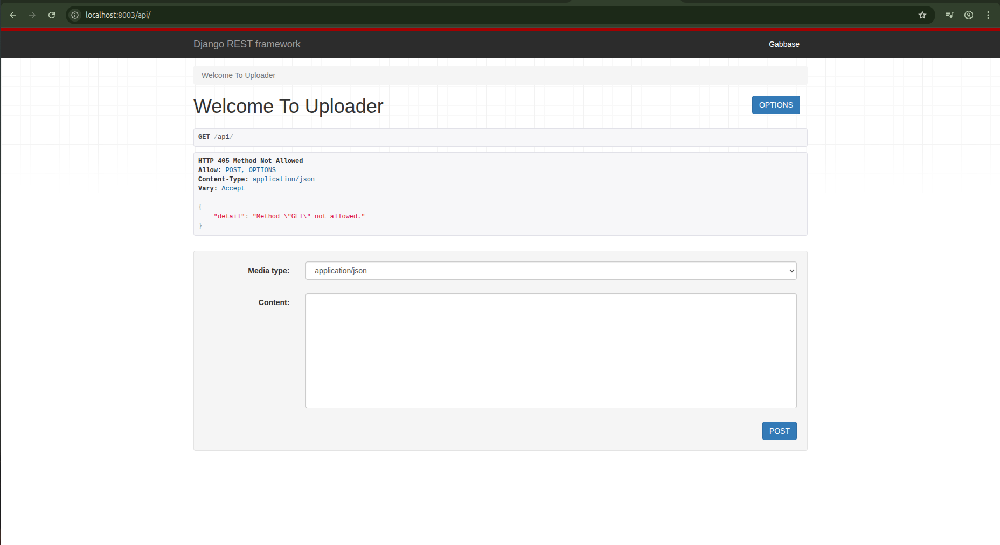
*Initial API welcome page.  '/api/-URL*

# List  View

*Paginated list view showing uploaded files across multiple pages.  'api/up/'list/-URL*

# Create

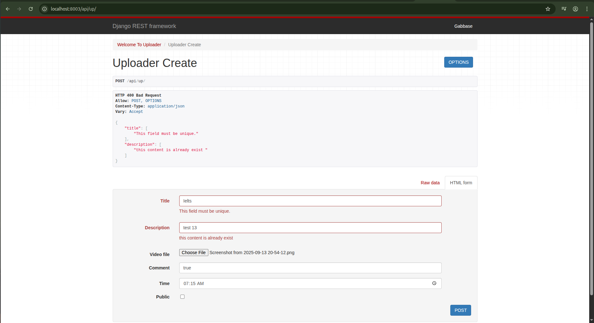
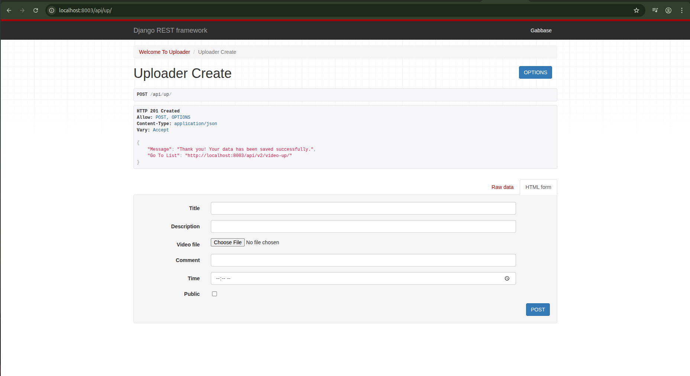
*Creating/uploading a new file via the API with built-in validation, ready for production use. 'api/up/'- URL*

# Retrieve

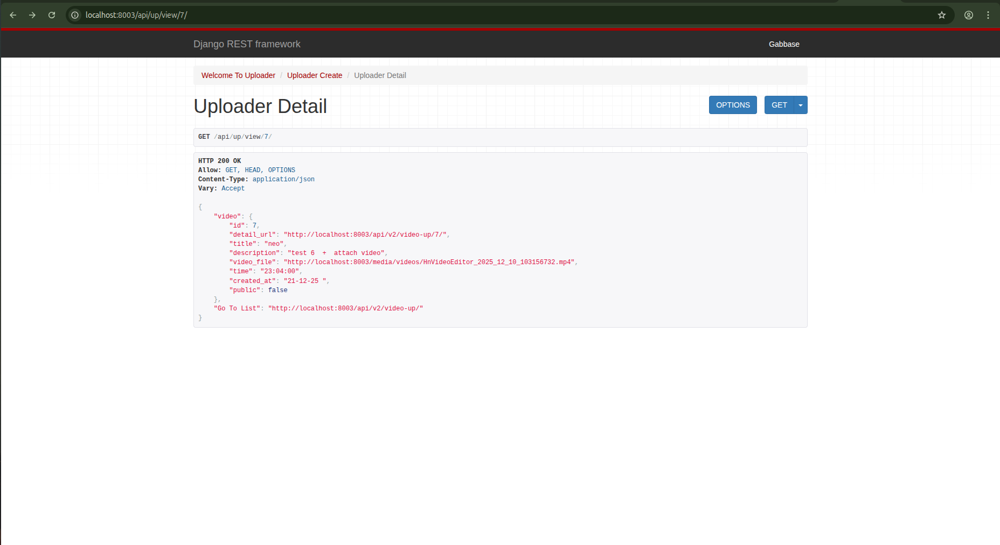
*Retrieving details of a single uploaded file .*'view/<int:pk>/'*-URL

# Update

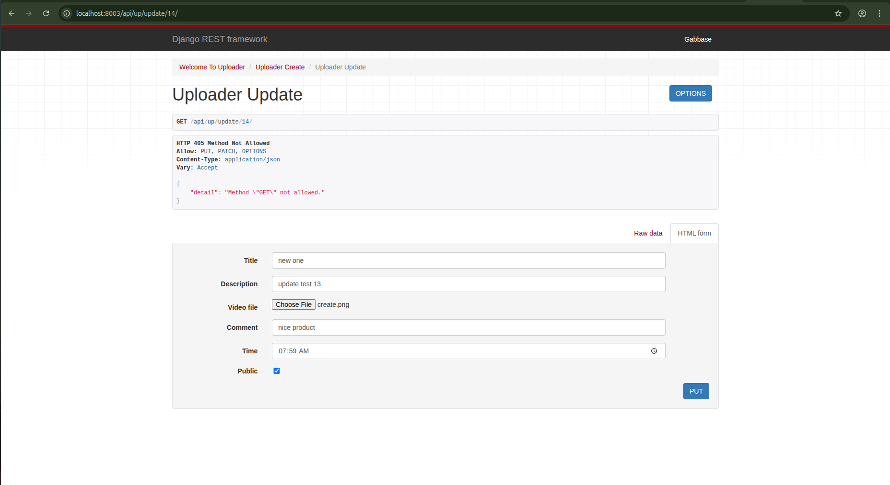
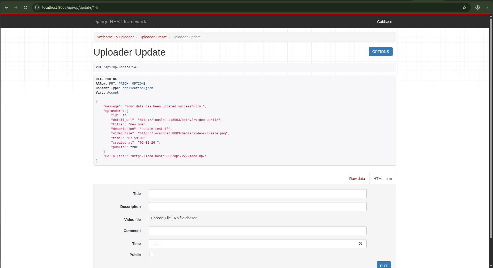
*Updating an existing file’s details . 'update/<int:pk>/'-URL*

# Delete 

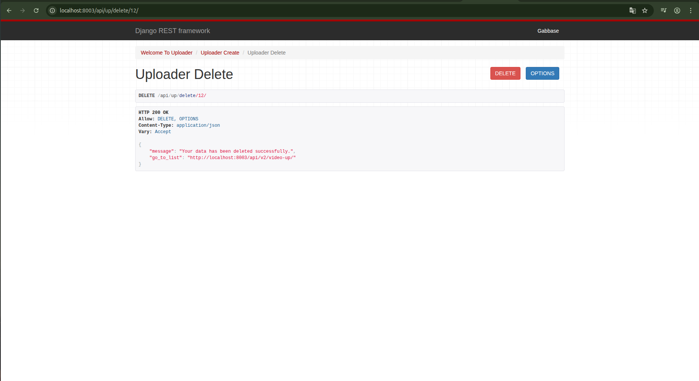
*Deleting a file from the server using the API. File is removed permanently. 'delete/<int:pk>/'URL*

# Search 

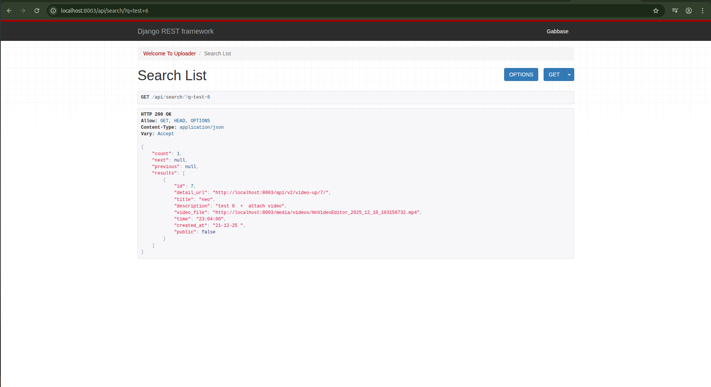
*Search endpoint filtering uploaded files by tite or description. 'api/search/?q=...URL*

# ViewSets

This project uses **Django REST Framework ViewSets** to manage standard CRUD operations for files, images, and videos.  
ViewSets simplify the code by automatically handling **list, create, retrieve, update, and delete** actions, while supporting **pagination, authentication, and permissions**.  
In this project, **ViewSets and APIViews work together seamlessly**, complementing each other in the Uploader app and making it **more robust and maintainable**.

# Api Root

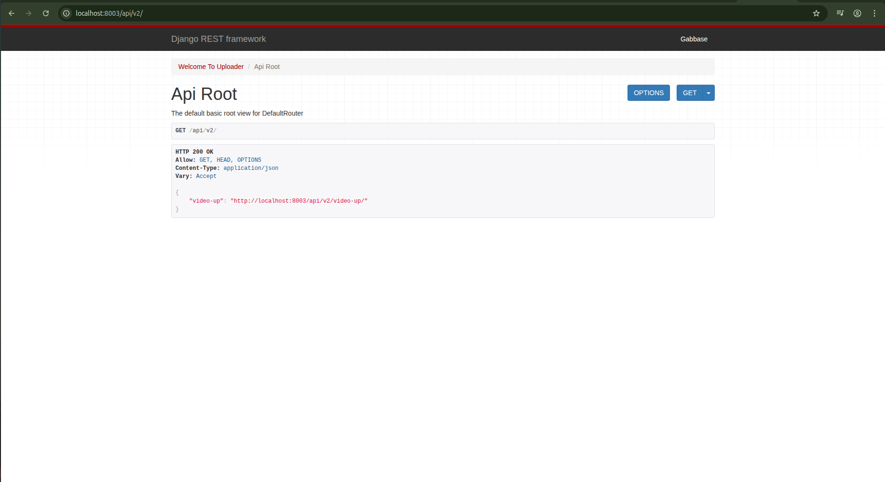
api/v2/-URL 

# List,Create, and Pagination 

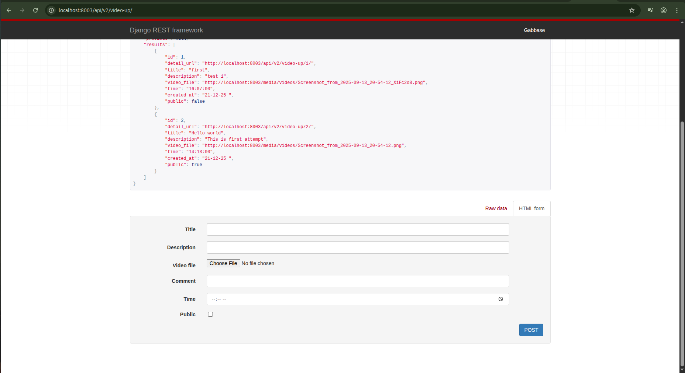
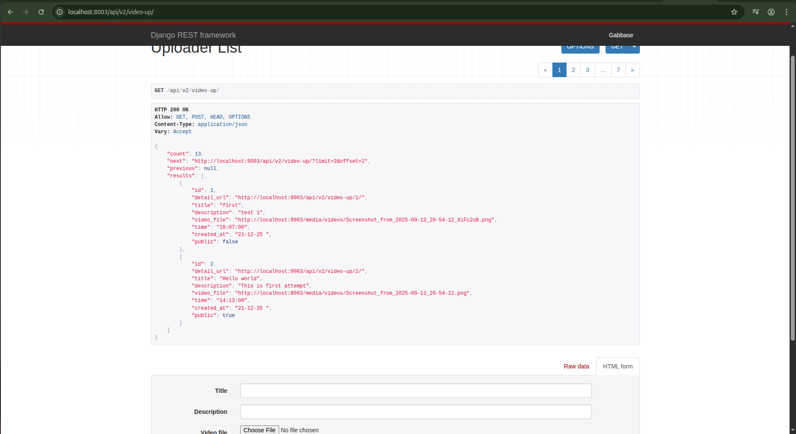
*Listing and creating uploaded files with pagination support.api/v2/video-up/-URL*

# Retrieve,Update, or Delete

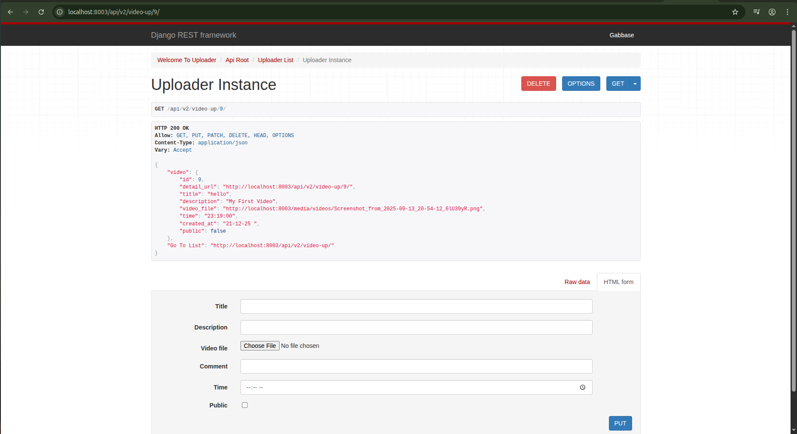
Retrieving, updating, and deleting an uploaded file via the API. .api/v2/video-up/1/-URL*

# Search 

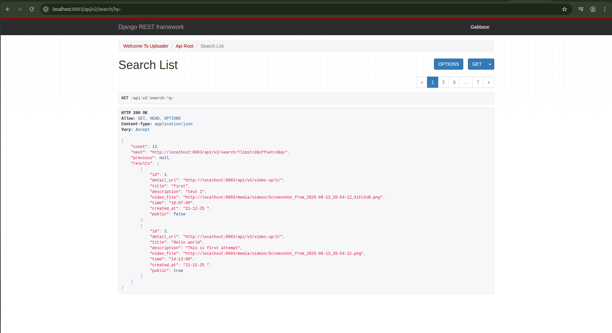

*Search works same as View but only URL chaging. api/v2/search/'-URL

# Authentication & Permissions

The Uploader API is protected using **authentication and permission classes** to restrict access to endpoints.

# Unauthorized Request and Authentication Method

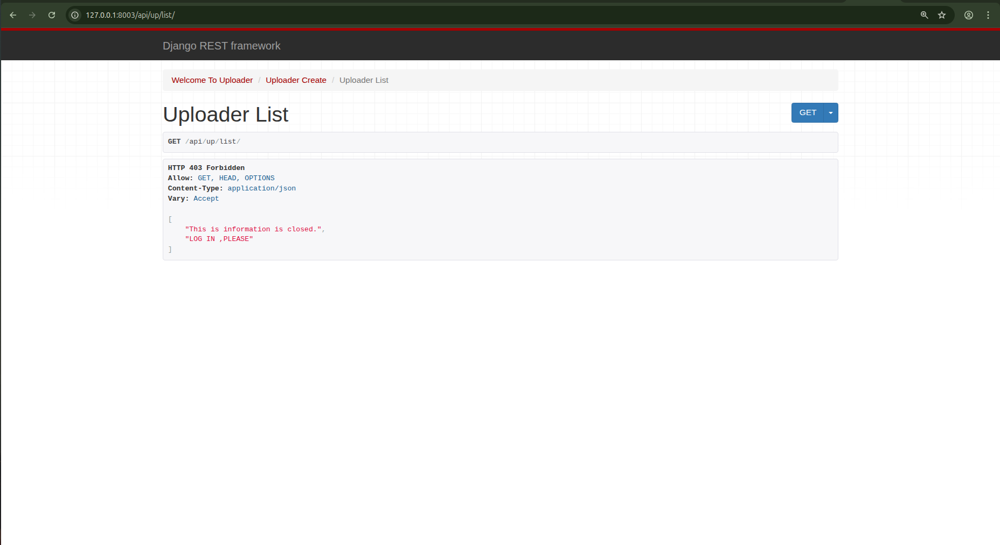
*Accessing `GET /api/up/list/` without authentication returns **HTTP 403 Forbidden**, indicating that login is required.*
- Uses **Simple JWT** for authentication
- Protected endpoints require a valid access token in the request header

# Py_Client

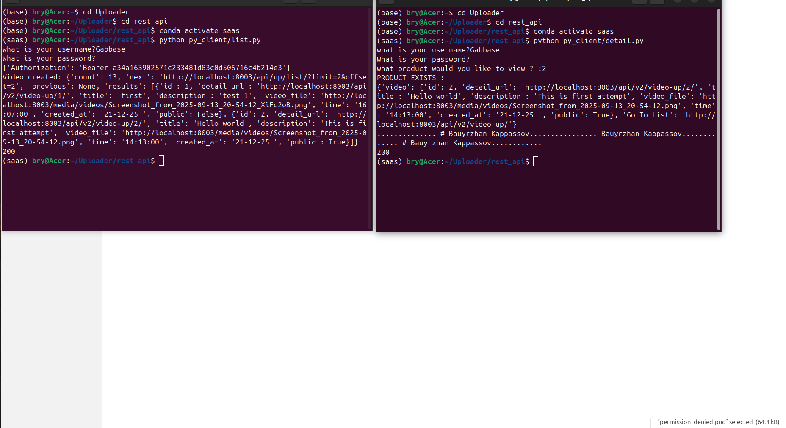
*A simple Python client used to test and interact with the REST API endpoints.*

# Video

  
